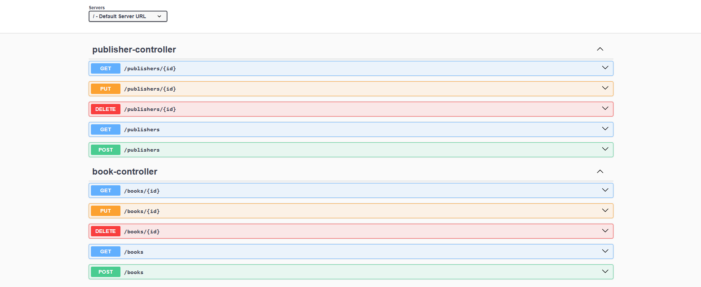
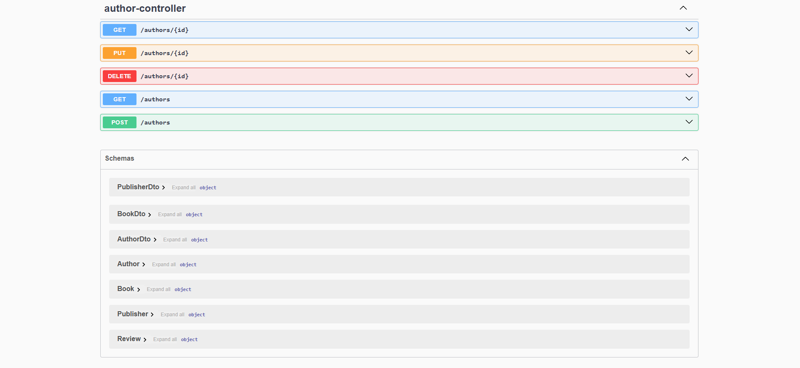

# DIO Java Spring Rest API Bookstore

API creation proposed as a [DIO](https://www.dio.me/) challenge for cloud deployment.

## Technologies
- [JDK 17.0.9](https://www.oracle.com/java/technologies/javase/jdk17-archive-downloads.html)
- [Spring Boot](https://spring.io/projects/spring-boot)
- [Spring MVC](https://docs.spring.io/spring-framework/reference/web/webmvc.html)
- [Spring Data JPA](https://spring.io/projects/spring-data-jpa)
- [PostgreSQL](https://www.postgresql.org/download/)
- [Railway](https://railway.com/)

### Links
API: 
- Books: [dio-java-spring-rest-api-booksto-production.up.railway.app/books](https://dio-java-spring-rest-api-booksto-production.up.railway.app/books)
- Authors: [dio-java-spring-rest-api-booksto-production.up.railway.app/authors](https://dio-java-spring-rest-api-booksto-production.up.railway.app/authors)
- Publishers: [dio-java-spring-rest-api-booksto-production.up.railway.app/publishers](https://dio-java-spring-rest-api-booksto-production.up.railway.app/publishers)

Swagger UI: [dio-java-spring-rest-api-booksto-production.up.railway.app/swagger-ui/index.html](https://dio-java-spring-rest-api-booksto-production.up.railway.app/swagger-ui/index.html)

## API Endpoints
```
GET    /books  
GET    /books/{id}  
POST   /books  
PUT    /books/{id}  
DELETE /books/{id}

GET    /authors  
GET    /authors/{id}  
POST   /authors  
PUT    /authors/{id}  
DELETE /authors/{id}

GET    /publishers  
GET    /publishers/{id}  
POST   /publishers  
PUT    /publishers/{id}  
DELETE /publishers/{id}
```



